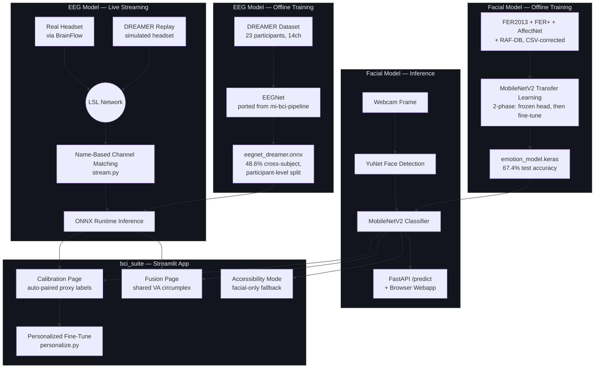
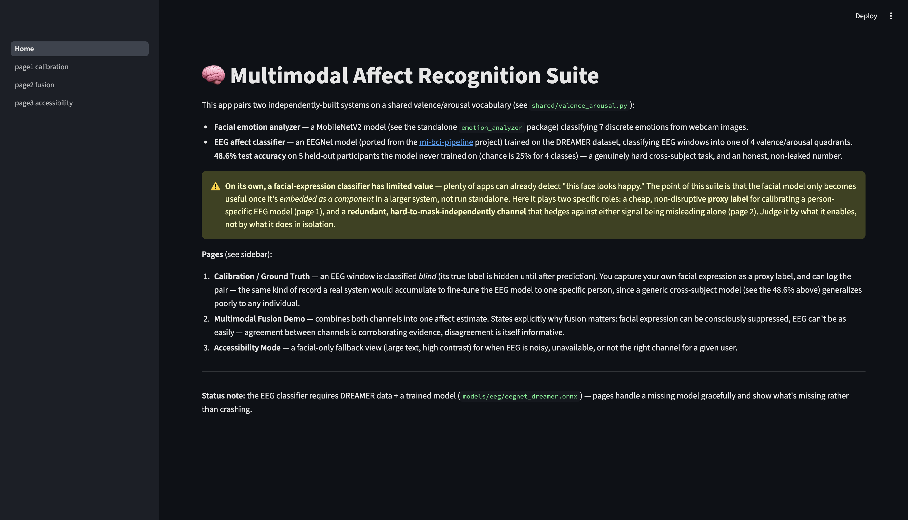
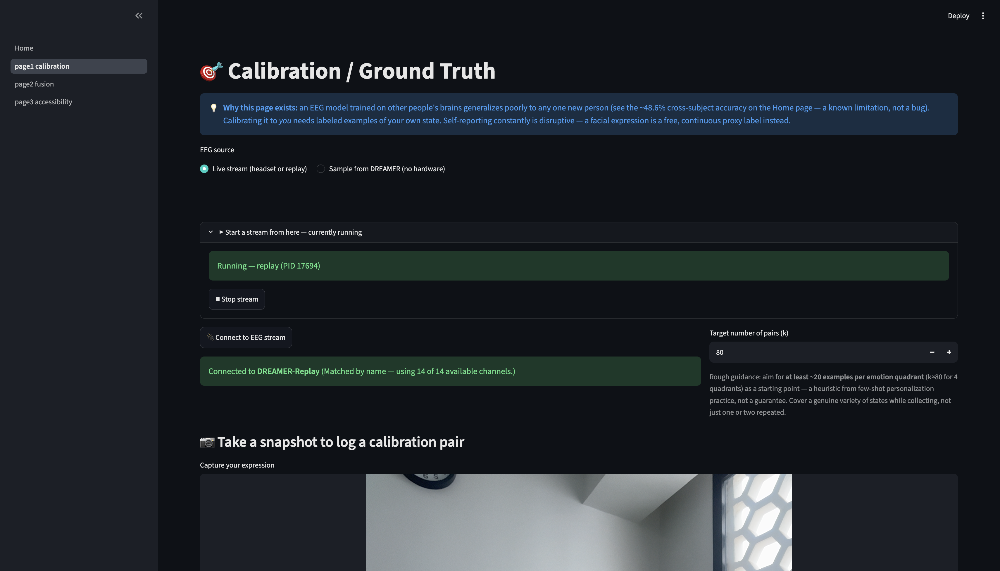
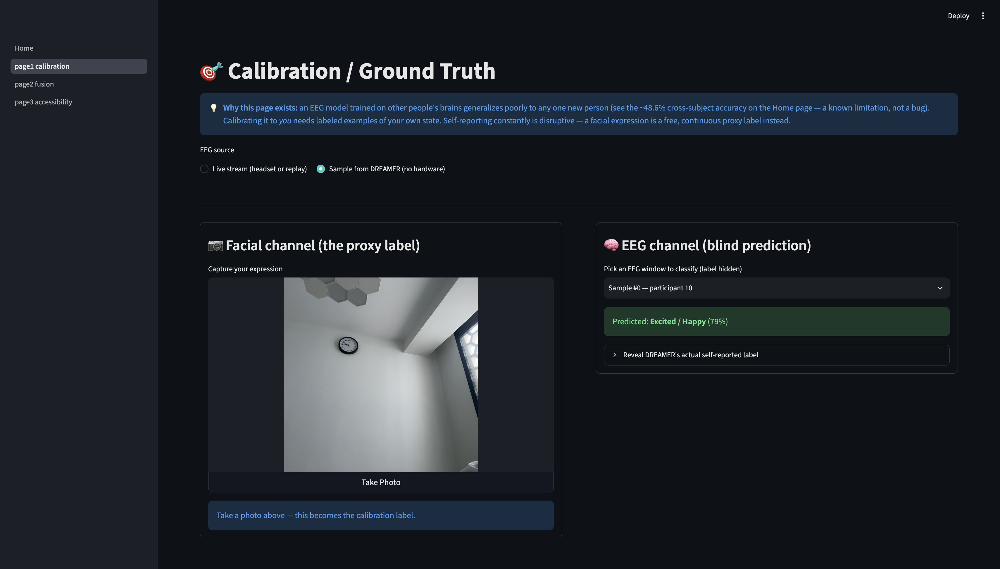
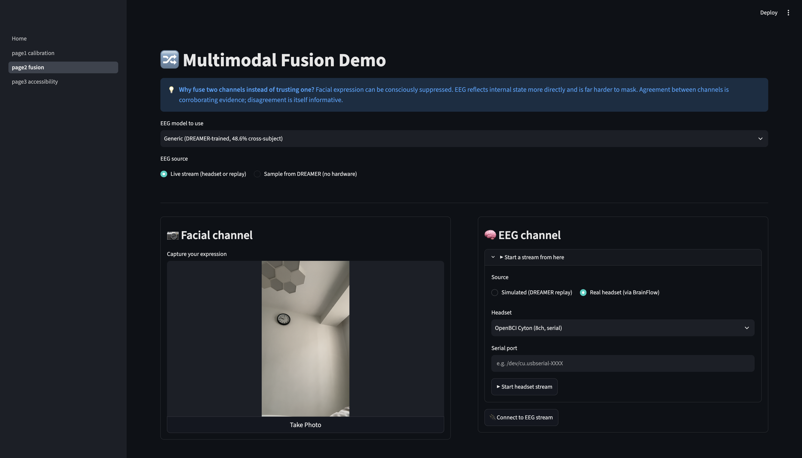
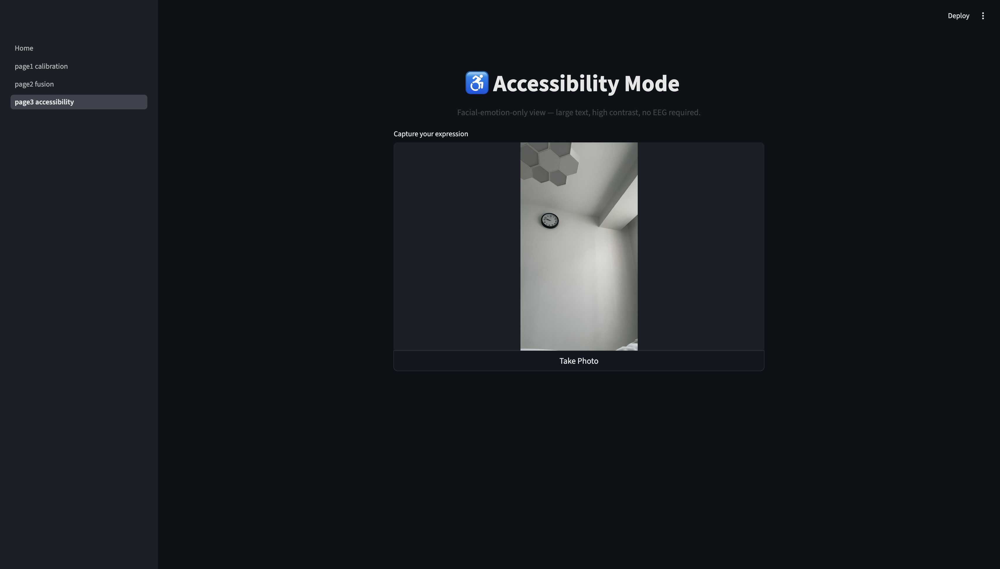

# Multimodal Affect Recognition Suite

A facial-expression classifier and an EEG-based affect classifier, built independently, then paired on one shared valence/arousal vocabulary — plus a live LSL streaming pipeline that lets either a real headset or a replayed recording drive the same code path, and a calibration workflow that personalizes the generic EEG model to one specific person using facial expression as a free, non-disruptive proxy label.

**Further reading:** [`docs/PROJECT_NARRATIVE.md`](docs/PROJECT_NARRATIVE.md) (the full build story) · [`docs/decisions.md`](docs/decisions.md) (engineering decision log) · [`docs/SELF_REVIEW.md`](docs/SELF_REVIEW.md) (critical self-assessment)

## What this is

- A trained facial emotion classifier (MobileNetV2 transfer learning, 7 classes) served via FastAPI and a browser webcam frontend — a standalone, public-facing system
- A trained EEG affect classifier (EEGNet, ported from [`mi-bci-pipeline`](https://github.com/BurhanxGodhra/mi-bci-pipeline)) classifying live or replayed EEG into one of 4 valence/arousal quadrants
- A live LSL streaming pipeline where a real headset (via BrainFlow) and a simulated headset (DREAMER replay) are literally indistinguishable to every downstream component
- A calibration workflow that auto-pairs facial-expression labels with live EEG windows and fine-tunes a personalized model from them — with a `k`-target, progress tracking, and a saved-model registry
- A multimodal fusion page combining both channels on a shared circumplex, with an explicit, stated reason fusion matters (facial expression can be masked; EEG is harder to)
- An honest account of a validation-methodology bug (train/test leakage) found and fixed in the EEG training pipeline, and of a circular-logic design flaw in the original calibration/fusion pages, found via user critique rather than internal review, and fixed

## What this is not

- Not validated against real EEG hardware in this development process — built and tested against a replayed DREAMER stream; the BrainFlow real-headset path is implemented but unverified against physical hardware
- Not a solved cross-subject BCI problem — the EEG model's 48.6% cross-subject accuracy (chance = 25%) is a genuine, honest result on a known-hard task, not close to subject-specific performance
- Not channel-count-agnostic — a headset lacking any of the 14 required electrode positions cannot use this model, a hardware fact no software fix changes (see Limitations)
- Not a continuous, hands-free facial capture system — Streamlit's camera widget requires an explicit snapshot click; true continuous capture would need a heavier dependency (`streamlit-webrtc`) not yet integrated

## Architecture



## Where this fits

A facial-expression classifier has limited value in isolation — plenty of apps already detect "this face looks happy." This project is meant to be embedded as a component alongside assistive BCI interfaces such as [`bci-speller`](https://github.com/BurhanxGodhra/bci-speller) and `mi-bci-pipeline`: an affective context layer adding emotional signal a speller can't express, a feedback trigger other systems could act on (detected frustration → simplify the interface), and a fallback channel for when the primary EEG signal is unreliable — which is specifically what Accessibility Mode is for. The calibration methodology built here (personalizing a generic cross-subject model with a cheap proxy label) is also a reusable pattern for the rest of the BCI portfolio, not a one-off feature of this repo. See `docs/PROJECT_NARRATIVE.md` §3 for the full reasoning.

## Screenshots

**Home** — suite overview, explicit statement of why the facial model needs integration to have value



**Calibration / Ground Truth** — live EEG stream connection, auto-paired facial/EEG calibration records, personalized training




**Multimodal Fusion Demo** — facial + EEG channels fused on a shared valence/arousal circumplex, with agreement/disagreement flagged explicitly



**Accessibility Mode** — facial-only fallback, large text, high contrast



## Results

### Facial emotion classifier (MobileNetV2, held-out test set)

| Version | Test accuracy | Notes |
|---|---|---|
| v1 (no augmentation, 8+6 epochs) | 61.2% | Initial baseline |
| v2 — augmentation added | 29.7% | **Regression** — augmentation applied after normalization, corrupting every training image (see `docs/decisions.md`, D-006) |
| v3 — augmentation order fixed | **67.4%** | Correct pipeline: augment on raw 0–255 scale, then normalize |

### EEG affect classifier (EEGNet, DREAMER, 4-class valence/arousal quadrant)

| Split methodology | Test accuracy | Notes |
|---|---|---|
| Window-level split (leaked) | 44.4% | Windows from the same trial appeared in both train and test — inflated, erratic validation accuracy |
| Participant-level split (corrected) | **48.6%** | 5 held-out participants never seen in training; chance = 25% |

Chance level for the 4-class EEG task is 25% — 48.6% cross-subject is a genuinely hard, honest result, consistent with EEG's well-documented cross-subject generalization difficulty.

## Setup

```bash
git clone https://github.com/BurhanxGodhra/ck_emotion_analyzer.git
cd ck_emotion_analyzer
python3 -m venv venv
source venv/bin/activate
pip install -e emotion_analyzer
pip install -e bci_suite
pip install -r requirements/analyzer.txt -r requirements/bci_suite.txt
```

**Datasets** — see `scripts/download_datasets.py` for FER2013/FER+ (auto-downloadable) and request-form links for AffectNet, RAF-DB, and DREAMER (all require manual approval; none can be redistributed).

**Before first run**, train both models (populates `models/`, which is gitignored):
```bash
python -m emotion_analyzer.models.train      # facial model — several hours on CPU
python -m bci_suite.eeg.train                # EEG model — a few minutes
```

## Running the system

**Standalone facial webapp:**
```bash
uvicorn emotion_analyzer.api.main:app --reload --port 8000
cd emotion_analyzer/webapp && python3 -m http.server 5500
```

**BCI suite:**
```bash
streamlit run bci_suite/Home.py
```

On the Calibration or Fusion pages, click **Start a stream from here** — the app manages the underlying EEG stream subprocess (simulated replay or a real BrainFlow-supported headset) automatically, no separate terminal needed.

## Project Structure

```
ck_emotion_analyzer/
├── emotion_analyzer/         # Standalone facial emotion classifier
│   ├── emotion_analyzer/
│   │   ├── data/              # Dataset loaders (FER2013, AffectNet, RAF-DB) + config
│   │   ├── models/            # MobileNetV2 architecture + training script
│   │   ├── inference/         # YuNet face detection + prediction
│   │   └── api/                # FastAPI /predict endpoint
│   └── webapp/                  # Browser frontend
├── bci_suite/                 # Multimodal BCI demo (Streamlit)
│   ├── Home.py
│   ├── pages/                  # Calibration, Fusion, Accessibility
│   └── bci_suite/
│       ├── eeg/                 # EEGNet, loaders, train, personalize, classifier,
│       │                        # stream, stream_launcher, replay, brainflow_bridge
│       └── fusion/
├── shared/
│   └── valence_arousal.py     # Shared VA vocabulary both models map onto
├── docs/                       # Narrative, decision log, self-review, screenshots
├── data/                       # Datasets (gitignored, request-based access)
├── models/                     # Trained checkpoints + exported ONNX (gitignored)
└── scripts/
```

**Note:** `data/`, `models/`, and `venv/` are intentionally excluded from version control — regenerated by running the training scripts above, not shipped as static files.

## Limitations

Structural constraints, inherent to the current design, not resolved by more engineering time alone:

- **No real headset tested.** The BrainFlow bridge (`brainflow_bridge.py`) is implemented and follows the same code path as the verified DREAMER replay, but has not been run against physical hardware.
- **Hard channel-compatibility floor.** A headset lacking any of the 14 required Emotiv-EPOC-montage electrode positions cannot use this model — name-based matching (see `docs/decisions.md`, D-012) helps headsets with *more* channels that include the needed positions, but cannot invent missing ones.
- **No true continuous facial capture.** Every calibration pair requires a manual snapshot click; auto-pairing happens on each click, not continuously in the background.
- **Personalized fine-tuning is unvalidated against real paired data.** `personalize.py`'s few-shot fine-tuning was built and reasoned about, but has only been exercised against a live user's facial expressions paired with a *replayed* single DREAMER trial — a genuinely mismatched calibration set, not a stand-in for real synced hardware data.
- **Vendor lock-in exists outside our control.** Some ecosystems (notably Emotiv's official Cortex API) require their own proprietary software running regardless of what's built here.

## Engineering Roadmap

1. **Validate against real hardware.** The single highest-value next step — confirm the BrainFlow bridge and channel-matching logic against an actual Muse or OpenBCI device, not just the replay simulation.
2. **Continuous facial capture via `streamlit-webrtc`.** Would remove the manual-snapshot constraint entirely, enabling genuinely continuous calibration pairing.
3. **Real synced calibration data.** Once real hardware is available, collect genuine paired (facial, EEG) sessions rather than pairing live facial expressions against a replayed recording from someone else's session.
4. **Channel-count-agnostic architecture.** A research-level redesign (channel-dropout training augmentation, or a channel-independent architecture) that could let the model gracefully handle headsets missing a few electrode positions, rather than requiring an exact 14-position match. Not attempted here — no guarantee of matching current accuracy, and DREAMER alone doesn't naturally support validating it.
5. **Weighted or learned fusion.** The current fusion strategy is a plain average of the two channels' VA points; a confidence-weighted or learned fusion is a natural next step.
6. **Wire the integration story into working code.** The README's "Where this fits" section describes this suite feeding `bci-speller`/`mi-bci-pipeline`; that connection is currently a documented plan, not implemented code (see `docs/PROJECT_NARRATIVE.md` §3).

## Licensing note on training data

The facial model is trained on FER2013, RAF-DB, and AffectNet (confidence-filtered) combined — not FER2013 alone. This project's data-licensing decisions (see `docs/decisions.md` D-001, superseded by D-017) were made in a personal/portfolio, non-commercial context, where the original restrictive-dataset concerns don't apply the same way they would to a redistributed or commercial product. **If you fork this project for a different purpose** — especially anything commercial or redistributed — re-evaluate AffectNet, RAF-DB, and DREAMER's access terms independently; their request-gated, research-use licenses still apply to that underlying data regardless of what this project chose to do with it.

## Citations

This project is built on:

- **Facial datasets**: Goodfellow, I. J. et al. (2013), *FER2013*, ICML Challenges in Representation Learning; Barsoum, E. et al. (2016), *FER+*, Microsoft; Li, S. & Deng, W., *RAF-DB*; Mollahosseini, A. et al., *AffectNet*.
- **EEG dataset**: Katsigiannis, S. & Ramzan, N. (2018). *DREAMER: A Database for Emotion Recognition Through EEG and ECG Signals from Wireless Low-cost Off-the-shelf Devices*. IEEE Journal of Biomedical and Health Informatics.
- **Model architecture (EEG)**: Lawhern, V. J. et al. (2018). *EEGNet: A Compact Convolutional Network for EEG-based Brain-Computer Interfaces*. Journal of Neural Engineering.
- **Streaming protocol**: Lab Streaming Layer (LSL) — [labstreaminglayer.org](https://labstreaminglayer.org)
- **Hardware bridge**: [BrainFlow](https://brainflow.org)

## License

MIT License — see [LICENSE](LICENSE) for details.
