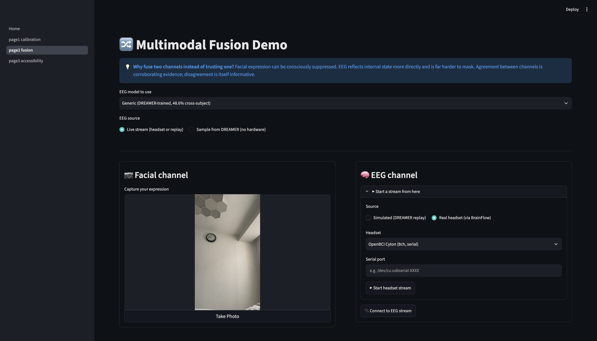
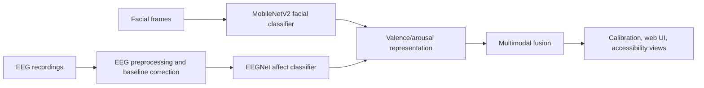

# Multimodal Affect Recognition Suite

A prototype that combines facial-expression and EEG pipelines with calibration, fusion, and accessibility-oriented interfaces; its evidence supports facial classification more strongly than EEG affect decoding.

## Results

Reported in the project documentation, not independently rerun in this review.

| Modality | Reported result | Interpretation |
|---|---:|---|
| Facial emotion classifier, held-out test set | 67.4% accuracy | Dataset-specific result; not a universal emotion measure |
| EEGNet on DREAMER, 4-class valence/arousal | 29.3% ± 6.0%; p=0.182 vs 25% chance | Not statistically distinguishable from chance in the reported evaluation |



## Architecture


```mermaid
flowchart LR
  F[Facial frames] --> M[MobileNetV2 facial classifier]
  E[EEG recordings] --> P[EEG preprocessing and baseline correction]
  P --> N[EEGNet affect classifier]
  M --> V[Valence/arousal representation]
  N --> V
  V --> X[Multimodal fusion]
  X --> U[Calibration, web UI, accessibility views]
```

## Quickstart and verification

The repository documents editable installs for both packages and separate training commands. It requires external datasets, and trained models are gitignored/not present in this checkout, so a complete inference run was not verified.

```bash
python3 -m venv .venv
source .venv/bin/activate
pip install -e emotion_analyzer
pip install -e bci_suite
pip install -r requirements/analyzer.txt -r requirements/bci_suite.txt
```

Acquire the datasets described in `scripts/download_datasets.py`, train the models, then follow the app launch steps in the repository's original setup guide. Do not treat this install snippet alone as a verified end-to-end quickstart.

## Limitations

- EEG performance is not significantly above the four-class chance rate in the reported experiment.
- Facial-expression labels are not ground truth for a person's internal affect.
- Dataset access and model artifacts are required; neither is fully bundled.
- Do not use the output for diagnosis, safety-critical decisions, or consequential judgments about a person.

## Next steps

1. Make the facial and EEG evaluation scripts independently reproducible from documented data splits.
2. Add a no-model UI demo and a small inference fixture for CI.
3. Revisit EEG labels, subject-wise validation, and uncertainty reporting before making fusion claims.
4. Conduct consent-based usability testing with clear controls over collection and retention.
